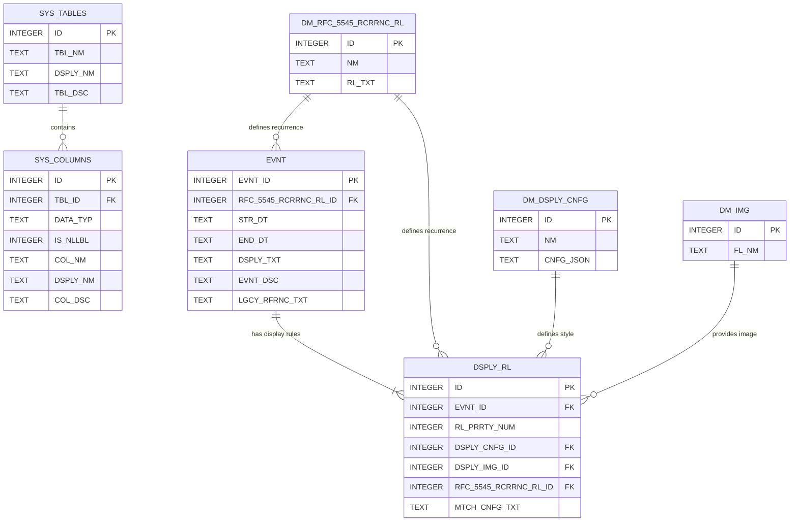

# Tími: Architecture

This document provides a detailed technical overview of the Tími application architecture. It is intended for developers, contributors, and anyone interested in the project's internal design.

---

## 1. The `.lca` (Local Calendar Archive) Format

The core of Tími's local-first philosophy is the `.lca` file. It is a standard ZIP archive with a proprietary extension to associate it with the Tími application.

### Structure

An `.lca` file has a simple and transparent structure:

```
my-calendar.lca (A standard ZIP archive)
|
+-- /timi.db
|
+-- /assets/
    |
    +-- image1.jpg
    +-- event-icon.png
```

*   **/timi.db:** This is the primary database file. It is a standard SQLite 3 database containing all calendar data. Before being added to the archive, this file is encrypted.
*   **/assets/:** A directory containing all binary assets, such as images, associated with calendar events. These files are stored directly without additional encryption, as the entire archive is protected.

### Encryption

*   **Algorithm:** The `/timi.db` file is encrypted using the **ChaCha20-Poly1305** stream cipher, a modern, secure, and open-source algorithm.
*   **Key Derivation:** The encryption key is derived from the user's passphrase using the **Argon2id** algorithm, a strong, memory-hard key derivation function that is highly resistant to brute-force attacks.
*   **Implementation:** All cryptographic operations are handled by the `libsodium-wrappers` library, a WebAssembly-powered and highly respected implementation of the libsodium library.

---

## 2. Database Schema

The Tími database is a relational SQLite database composed of 7 tables: 2 for system metadata, 3 for domain data, and 2 for core application logic.

### Rationale for Integer IDs

The primary key for events (`EVNT.EVNT_ID`) is an `INTEGER`. While UUIDs are common in distributed systems, Tími's local-first nature makes sequential integers a simpler and more performant choice. This design assumes a single-user context where the likelihood of merging two distinct archives is a secondary concern to core application performance and simplicity.

### Schema Diagram (Conceptual)



### Table Definitions

*(The full table definitions with column descriptions are managed programmatically and can be queried directly from the `SYS_TABLES` and `SYS_COLUMNS` tables within the application.)*
